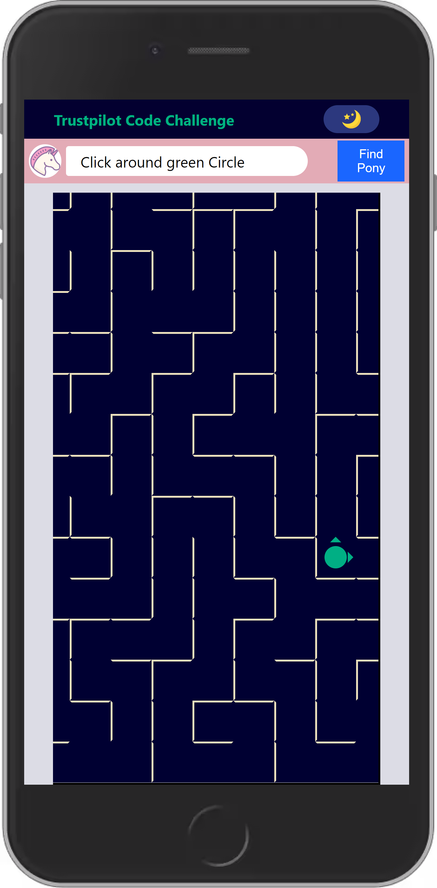
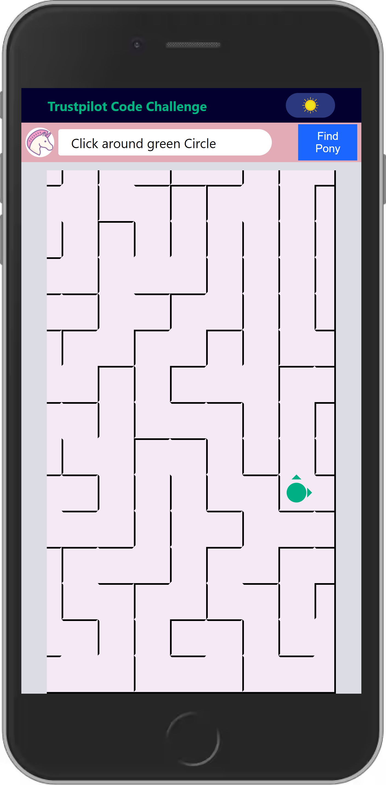
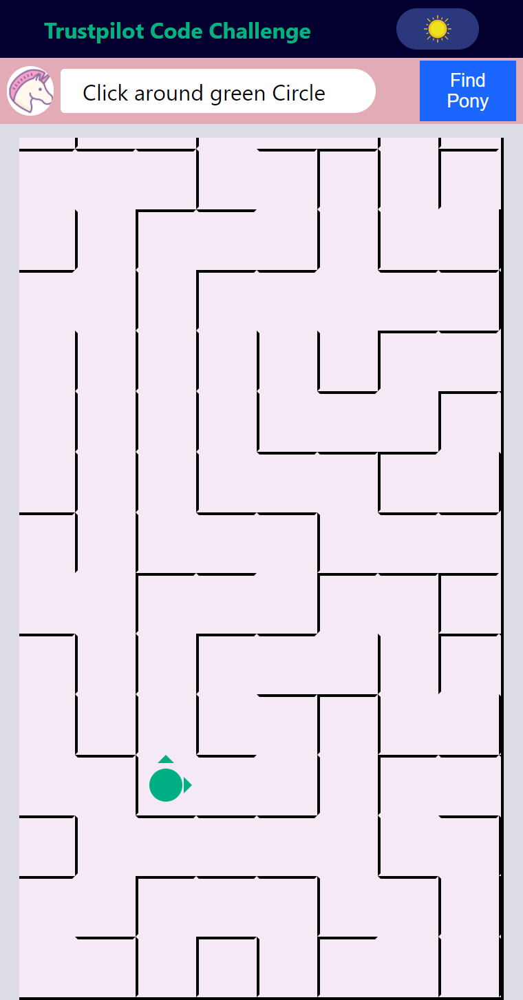
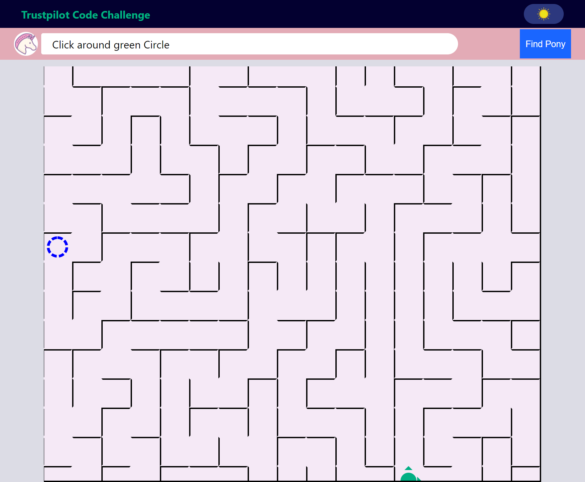

# Truspilot Poney Code Challenge

## Technologies
- React
- React Hooks
- Styled-components
- css flexbox
## Features

### useHTTP hook
with inspiration of useFetch library I make a very simple http hook for sending get and post request.
### Dark theme and Light Theme

    

### Navigation With Keyboard
you can move player with arrow keys

### Scroll able maze for different screen

each maze cell is 44px, whether it's run on mobile screen or large screen, the benefit is that this size is good for accessebility.
then app calcuate best width and height for each window size.

    

### Find Pony Button

there is a button to find a pony , like when user scroll and he/she can't see the pony so with this button he/she can find the pony very easily.

## Run the project
just run `npm install` on project and then `npm start`